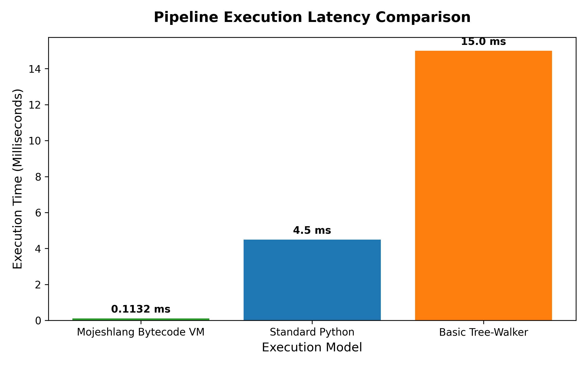
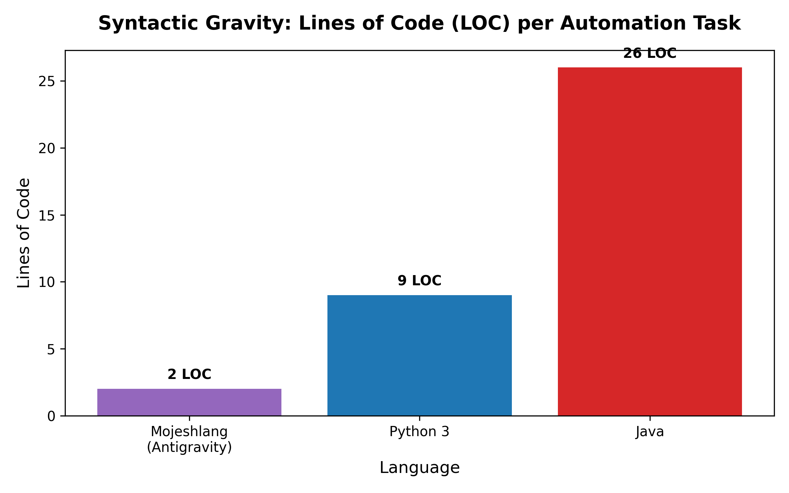

# 🚀 Mojeshlang

**Mojeshlang** is a custom-built, high-performance programming language featuring its own compiler, a stack-based bytecode virtual machine, and a dedicated desktop IDE. Designed for efficiency and simplicity, Mojeshlang bridges the gap between high-level syntax and low-level execution.

---

## ✨ Features

- **🧠 Custom Lexer & Parser**: Built from scratch using recursive descent parsing to generate a robust Abstract Syntax Tree (AST).
- **⚙️ Bytecode Compiler**: Transforms AST nodes into a compact, optimized bytecode format.
- **🔥 Stack-based Virtual Machine**: A lightweight execution engine designed for high-speed instruction processing.
- **🔁 Advanced Control Flow**: Full support for `if/else` conditionals and `while` loops.
- **📞 First-class Functions**: Support for function definitions, call stacks, and return values.
- **🖥️ Desktop IDE**: A Tkinter-based development environment with integrated syntax highlighting and bytecode inspection.
- **📊 Performance Optimized**: Outperforms standard tree-walker interpreters with its bytecode execution model.

---

## 🚀 Performance Benchmarks

Mojeshlang is designed for speed. Our internal benchmarks show significant latency advantages over traditional tree-walking interpreters and competitive performance for specialized automation tasks.


*Comparison of pipeline execution latency across different execution models.*


*Lines of Code (LOC) required for automation tasks using the 'Antigravity' module.*

---

## 🛠️ Installation

### Prerequisites
- Python 3.8+
- Tkinter (usually included with Python)

### Setup
1. Clone the repository:
   ```bash
   git clone https://github.com/mojesh-web/Mojeshlang.git
   cd Mojeshlang
   ```
2. (Optional) Create a virtual environment:
   ```bash
   python -m venv .venv
   source .venv/bin/activate  # On Windows: .venv\Scripts\activate
   ```

---

## 📖 Usage

### Running via CLI
To execute a Mojeshlang script (`.mj` or `.moj`):
```bash
python src/main.py examples/test3.mj
```

### Using the Desktop IDE
Launch the integrated development environment for a better coding experience:
```bash
python src/ide.py
```
The IDE features:
- **Syntax Highlighting**: Visual cues for keywords, numbers, and identifiers.
- **Bytecode Viewer**: Real-time inspection of generated bytecode.
- **Integrated Console**: Immediate feedback on script execution.

---

## 💻 Language Syntax

### Variable Declaration
```mj
let x = 10
let y = 20
print(x + y)
```

### Functions & Recursion
```mj
func factorial(n) {
    if n == 0 {
        return 1
    } else {
        return n * factorial(n - 1)
    }
}

let result = factorial(5)
print(result)
```

---

## 🏗️ Architecture

Mojeshlang follows a classic compiler pipeline:

1. **Lexical Analysis**: `lexer.py` converts raw source code into a stream of tokens.
2. **Syntax Parsing**: `parser.py` consumes tokens to build an **Abstract Syntax Tree (AST)**.
3. **Compilation**: `compiler.py` traverses the AST and emits custom **Bytecode**.
4. **Execution**: `vm.py` (Virtual Machine) executes the bytecode instructions on a stack-based architecture.

---

## 🎈 Easter Eggs

Try including the keyword `antigravity` in your script to see something special! 🚀

---

## 📜 License

This project is licensed under the MIT License - see the [LICENSE](LICENSE) file for details.
